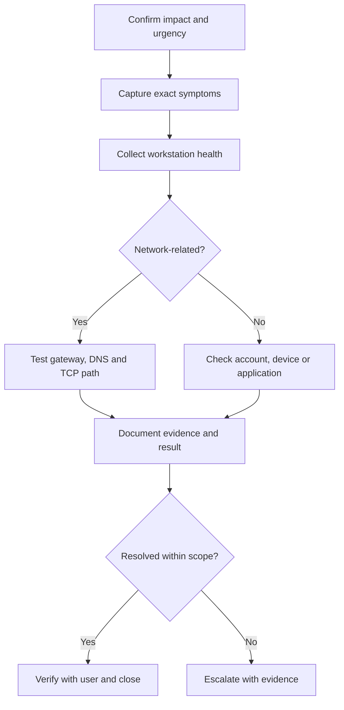

# IT Support Operations Toolkit

A practical portfolio project demonstrating repeatable service-desk and desktop-support work: Windows health collection, network fault isolation, incident triage, user lifecycle controls and professional ticket documentation.

The project is designed around a core support principle: **collect evidence first, make the fault domain visible, document every meaningful action, and escalate with useful context.**

## Skills demonstrated

| Capability | Evidence in this repository |
|---|---|
| Windows troubleshooting | Read-only workstation health collector |
| Network support | DNS, gateway and TCP-path diagnostic script |
| Incident management | Impact, urgency, prioritisation and escalation runbook |
| Onboarding/offboarding | Identity, access, device and asset-control checklist |
| Ticket quality | Structured support-note template |
| Security awareness | No credential collection; least-privilege and data-handling guidance |
| Automation discipline | Structured JSON output and automated PowerShell syntax validation |

## Toolkit contents

```text
it-support-operations-toolkit/
├── scripts/
│   ├── Get-WorkstationHealth.ps1
│   └── Test-NetworkPath.ps1
├── runbooks/
│   ├── incident-triage.md
│   └── onboarding-offboarding.md
├── templates/
│   └── ticket-note.md
├── sample-output/
│   └── workstation-health.example.json
├── .github/workflows/
│   └── powershell-syntax.yml
├── .gitignore
└── LICENSE
```

## 1. Workstation health snapshot

`Get-WorkstationHealth.ps1` collects a structured, read-only overview of:

- Windows version, build and uptime
- device manufacturer, model and memory
- fixed-disk capacity and low-space warnings
- active network adapters, addresses, gateways and DNS servers
- DNS Client, Print Spooler and Windows Update service state
- common pending-restart indicators
- optional critical/error System-event summary from the previous 24 hours

### Run it

```powershell
Set-ExecutionPolicy -Scope Process -ExecutionPolicy Bypass
.\scripts\Get-WorkstationHealth.ps1 `
  -OutputPath .\output\PC-014.diagnostics.json `
  -IncludeEventSummary
```

The execution-policy change above applies only to the current PowerShell process. Follow the employer's approved script-execution policy in a managed environment.

## 2. Network path test

`Test-NetworkPath.ps1` separates common connectivity failure domains by checking:

1. active local interfaces
2. default-gateway reachability
3. DNS resolution
4. TCP connectivity to the required service port

```powershell
.\scripts\Test-NetworkPath.ps1 `
  -Target login.microsoftonline.com `
  -Port 443 `
  -OutputPath .\output\m365-network.diagnostics.json
```

The result includes a suggested troubleshooting focus such as DNS, local gateway, firewall/routing, target service, or passed connectivity.

## Example support workflow



## Runbooks and templates

- [Incident triage runbook](runbooks/incident-triage.md) — scope, priority, fault-domain checks, documentation and escalation
- [Onboarding/offboarding runbook](runbooks/onboarding-offboarding.md) — identity, access, device, asset and data controls
- [Ticket note template](templates/ticket-note.md) — symptoms, impact, evidence, actions, communication and closure
- [Synthetic diagnostic example](sample-output/workstation-health.example.json) — demonstrates the output schema without exposing real device or user data

## Safety and data handling

- The scripts are diagnostic and do not change Windows settings.
- They do not collect passwords, tokens, browser data or file contents.
- Diagnostic files can still contain usernames, hostnames, IP addresses and device details. Treat them as internal support data.
- Review generated output before attaching it to a ticket or sharing it.
- Use approved storage, retention and access-control procedures.
- Run with standard-user permissions unless an authorised support procedure requires elevation.

## Validation

A GitHub Actions workflow parses every `.ps1` file on Windows after relevant pushes and pull requests. This catches PowerShell syntax errors without executing workstation diagnostics.

## Possible next iterations

- add Pester tests with mocked Windows commands
- add a disk-space threshold parameter
- provide optional CSV output for fleet comparison
- add a printer troubleshooting runbook
- add a Microsoft 365 sign-in triage checklist
- map ticket examples to a generic ITIL-style priority matrix

## Author

**Isaac Lovelace Yanney**  
IT Support & Technical Operations  
[GitHub profile](https://github.com/isaacyanney) · [LinkedIn](https://www.linkedin.com/in/isaac-lovelace-yanney/) · [Portfolio](https://isaacyanney.github.io)
